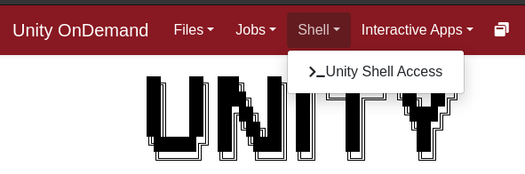
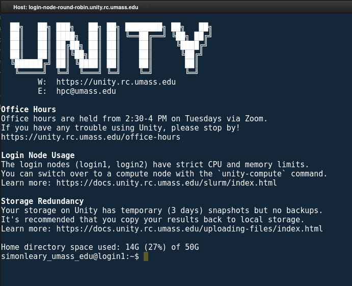
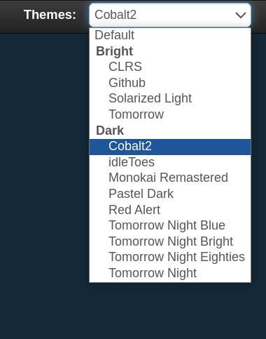

# Connect via OpenOnDemand

The easiest way to connect to Unity is at [ood.unity.rc.umass.edu](http://ood.unity.rc.umass.edu).

Unity OnDemand uses your organization's identity provider to give access to Unity. This means that you no longer need to install SSH, configure SSH, setup public and private keys, **all you need to do is login with your browser like any other site.** The end result is the same.

### Getting a Login Shell
Login to [Unity OnDemand](http://ood.unity.rc.umass.edu) with your organization's identity provider, and click on `Unity Shell Access`.

It should open a new tab that looks like this:

You can also customize shell themes:

