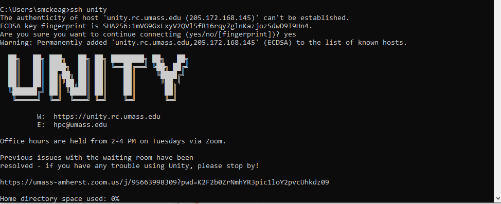

# SSH Connection #
The most traditional method of connecting to Unity is using an SSH connection. A **shell** is what you type commands into. The most common shell in linux is bash, which is what you will likely be using on Unity. SSH stands for "secure shell".

### Configure SSH Keys ###
The authentication method we use for SSH connections is with public/private RSA keys. You can read more about the public/private key exchange [here](https://ssd.eff.org/en/module/deep-dive-end-end-encryption-how-do-public-key-encryption-systems-work).

For the purposes of this guide, you should know that there is a public key which is stored on the server, and a private key, which you keep on your local computer. Think of them like your name and your social security number, respectively. In very basic terms, you authenticate the public key with your private key and that allows you to login to Unity.

You must save your public key on Unity by adding it in your [account settings](https://unity.rc.umass.edu/panel/account.php). If you are unsure how to generate a public/private key pair, simply click on 'Generate Key'. The public key will be added to our database, and the private key will be downloaded to your computer.

!!! note
    It's recommended that you place this downloaded private key in your home directory's `.ssh` folder. This is `C:/Users/YOUR_NAME/.ssh` in Windows, `/home/YOUR_NAME/.ssh` in Linux, and `/Users/YOUR_NAME` in [Mac](https://www.cnet.com/tech/computing/how-to-find-your-macs-home-folder-and-add-it-to-finder/). In the terminal, a shortcut for this directory is the `~` symbol.

    This command will make the move on any operating system:

    ```
    mv ~/Downloads/privkey.key ~/.ssh/unity-privkey.key
    ```

    On Linux/Mac, you will need to change the permissions on the file due to its importance to security.

    ```
    chmod 600 ~/.ssh/unity-privkey.key
    ```

    It's recommended that you also add a password to this file using the following command:

    ```
    ssh-keygen -p -f ~/.ssh/unity-privkey.key
    ```

### Connection Details ###
If you know what to do with this information already, you can skip the rest of this guide.

* Hostname/Address: `unity.rc.umass.edu`
* Username: `NETID_school_edu`
!!! note
    Your username is in the format `<organization username>_<organization>_edu`. View your username [here](https://unity.rc.umass.edu/panel/account.php)


### [CLI](https://www.w3schools.com/whatis/whatis_cli.asp) Users ###
We recommend connecting to Unity via the terminal. Windows, Mac, and most distributions of linux come with the OpenSSH client, which you can use to connect to Unity in your terminal.

If the file `~/.ssh/config` doesn't exist, create it. Copy the following contents to your Notepad and replace `<NETID>` and `<PATH_TO_PRIVATE_KEY>` to your specifications:
Remember to save the file in a directory of your choosing, without an extension.
```
Host unity
     HostName unity.rc.umass.edu
     User <USERID>_<ORGANIZATION>_edu
     IdentityFile <PATH_TO_PRIVATE_KEY>
```
!!! note
    Doing this with a text editor and a file explorer can be challenging because these user friendly methods don't like files without an extension, and the ssh config file must not have an extension.

    In Windows Notepad, you can save a file with no extension in the 'All Files' category, and windows will add the `.txt` extension regardless, which won't work.

    The Mac TextEdit doesn't even have the option to save as `.txt`, which is tremendously unhelpful. You can make your current file plain-text formatted using ⌘-⇧-T, and [you can add plain-text as a 'Save as' option in the config.](https://macreports.com/how-to-create-a-text-txt-file-on-a-mac/)

    The most reliable way to put your OpenSSH config file in the correct location is to open the terminal and use the `mv` (move) command, which will rename files with no fuss.

    ```
    mv path/to/source-file path/to/desination-file
    ```

    ```
    mv ~/Desktop/ssh-config.txt ~/.ssh/config
    ```
Once the OpenSSH config file is in place, you can connect to Unity in your terminal using the command `ssh unity`.



### Windows GUI Users ###
Windows users can use [PuTTY](https://www.chiark.greenend.org.uk/~sgtatham/putty/latest.html) to connect to Unity. Download and install PuTTY by following the link above. Be sure to select the 64 bit / 32 bit download depending on your system. Most are 64 bit, but if you are unsure 32 bit will always work.

Open PuTTY and enter hostname `unity.rc.umass.edu` on the main page


On the left sidebar, navigate to connection -> data, and enter your username.


On the left sidebar, navigate to connection -> ssh -> auth, and browse to your private key location.


Finally, in the main screen again, save the profile you created so you don't have to enter this information every time. Enter `unity` as the profile name and click `save`. You can then double click on `unity` under saved sessions to connect to Unity right away.


The server's ssh-ed25519 key fingerprint is:

```ssh-ed25519 255 SHA256:jC7BF7h5/RJo5Svx1v+lufdf+I/ogu5dQV2sUe+y8ek```


If this key matches what is on your terminal, go ahead and click "Accept".

