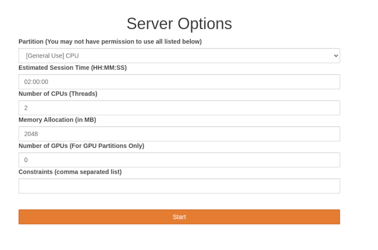
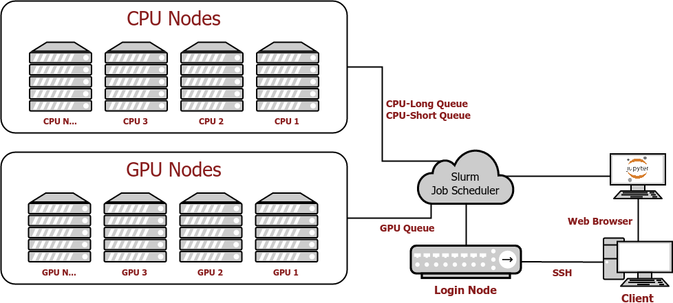

# Introduction to Unity #
Welcome to Unity!
The Unity cluster is a collaborative, multi-institutional high-performance computing cluster located at the Massachusetts Green High Performance Computing Center [(MGHPCC)](www.mghpcc.org). The cluster is under active development and supports primarily research activities. Partnering institutions currently include UMass Amherst, UMass Dartmouth, and University of Rhode Island.

## Accessing Unity ##

**Faculty/PI's:** If you are a Faculty member or [Principal Investigator (PI)](https://www.umass.edu/research/what-principal-investigator-pi-and-who-eligible), please create an account on the Unity [main page](https://unity.rc.umass.edu). Use your campus NetID and password to sign up for a Unity account.  Once your account is created, go to Account Settings and request PI status by clicking the "Request PI account" button.  Once your account is approved you will be able to approve adding additional users to your PI group in the “My Users” button on the side menu.  Adding users will grant them access to your PI `/work` directory.  Users in your group need to request access to join your PI group.  You cannot create accounts for your users.

**Students:** In order to use Unity you must be working with a PI and they must grant you access to their PI group.

Create an account on the Unity [main page](https://unity.rc.umass.edu).
Click "Login/Request Account". Click on your institution or search for it via the search bar. Once your account is created you will need to assign a PI to it.  To do this, go to "My PIs" using the left side menu and click the large "+" button. Follow the prompts to generate your unique SSH key. You can search for your PI by name. Once found, click on “Send Request”. After your PI approves your request, you will have access to Unity and your PI’s project code and data stored in Unity. You can view, join, or leave a PI group by clicking "My PIs".

**Note:** If you are a student, **do not request a PI account**.  This will slow the process down.  You should assign a PI to your account by clicking the "+" button.  Your PI will then be able to approve your account.

**Something not working for you?**  Send an email to <hpc@umass.edu> with as much detail as you can provide to open a support ticket.
Need additional help?  We offer office hours every week on Tuesdays 2:30-4 PM on [Zoom](https://umass-amherst.zoom.us/j/95663998309?pwd=K2F2b0ZrNmhYR3pic1loY2pvcUhkdz09). Be sure to check the [cluster notes page](https://unity.rc.umass.edu/index.php) for up-to-date information on any canceled/delayed office hours.

**Need expert help** using the cluster and optimizing your code?  We encourage you to schedule an appointment with one of our experienced HPC facilitators.  Send an email to <hpc@umass.edu> and request an HPC facilitator consultation.

## Connecting to the cluster ##
You can connect to Unity in two ways, an SSH connection (the standard Linux console), or an instance of JupyterHub:

[JupyterHub](connecting/jupyter.md) is the easiest to get up and going. To work with JupyterHub, it's a good idea to get aquainted with roughly how demanding the job you're uploading is though. You just need to be familiar with how roughly how many of each resource you will need (Image below). Most of the time you will only ever need a single CPU or GPU, but if you have terabytes of data to analyze, then you should probably consider getting multiple GPUs and CPUs.

When connecting the portal, click on JupyterHub tab located at the bottom of the options list on the left side of the window. This will take you to the JupyterHub for Unity, which looks like this:

You will be asked to select what computer resources you want/need for the job you want to upload. Once you attempt to spawn your notebook and resources become available, you will be able to use JupyterHub as if it is running on your own computer.

[SSH](connecting/ssh.md) is the more traditional method of using an HPC cluster. You will connect to the login node of unity, and you will be responsible for starting your own jobs. This can be more useful than JupyterHubs for jobs that last a long time and must be left unattended, or to have much more refined control over the resources allocated for your job.

## Requesting Resources ##
If you are on an SSH connection, you will have to [request resources with Slurm](slurm/index.md). Once you decide on what resources you want, you will submit that information to the scheduler, which will place your job in the queue. When the resources are available, your job will start.

Requesting resources in the cluster and all parameters allowed is discussed in more detail [here](slurm/index.md).

#### Starting Job ####
Once the scheduler has started your job, it will run on some node in the cluster, using some resources that were defined by your parameters. It is not important what node the job runs on from the point of view of the client.

#### Ending Job ####
Once the job has finished, the scheduler will return whatever info you requested in your parameters.

## How the Unity Cluster Works ##

It's recommended that you read the "HPC Jargon" section of the [common terms](jargon.md) page.

### The Basics ###
Unity is a **High Performance Computing Cluster (HPC Cluster)**. That is, a system made up of many smaller computers (**nodes**) that work together to behave like one large computer. An HPC cluster focuses most on computational power and efficiency, as the name entails. HPC allows a user to utilize the power of many computers simultaneously. This is useful for large tasks that are infeasible for a common laptop or desktop.

When you use your personal computer, the operating system decides what resources (CPU, RAM, etc.) should be used for a given task. For example, if you were to open a calculator program and multiply some numbers, the operating system would determine what CPU threads should be used to perform the calculation, and how much of the graphics card should be used in rendering the calculator on your screen.

An HPC **job scheduler** does the same thing but on a much bigger scale. Instead of a single process on one machine, an HPC cluster handles **jobs** which can be run on many machines at one time. With multiple users, the scheduler must manage incoming requests, reserve the resources, and connect those resources to those who have requested them. The Unity job scheduler is called **Slurm**.

### How Unity Works ###

Here is a general step by step process that governs how the Unity Cluster works:

1. Client connects to Unity using [SSH](connecting/ssh.md) or [JupyterHub](connecting/jupyter.md).
1. Client schedules a job through Slurm.
1. Slurm allocates resources and connects the client to them.
1. Job runs.
    * Interactive job: Client does their work until they close the session or run out of time.
    * Batch job: The job runs until it finishes its tasks or runs out of time.
1. Job returns output.
    * Batch job: The output to the command line is saved by slurm to a file like `slurm-<JobID>.out`.