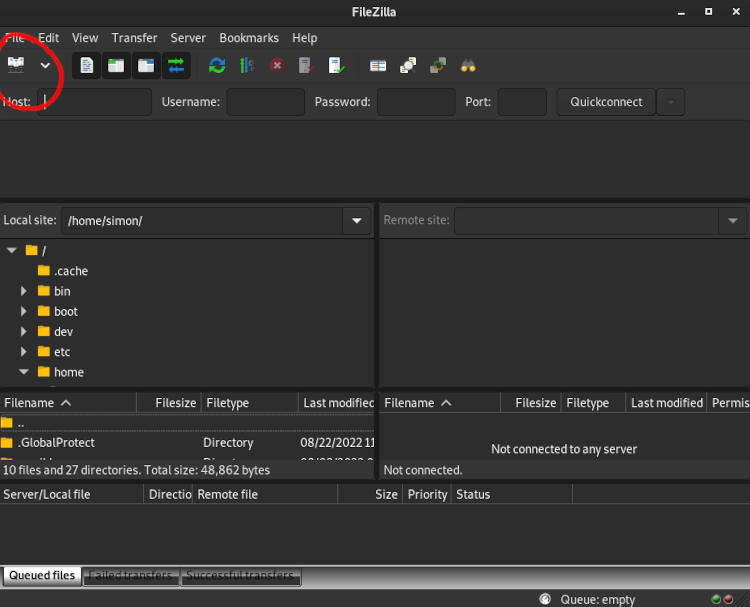

## FileZilla ##
FileZilla can use either an `.rsa` or a `.ppk` private key, but the 'Browse' button will show only `.ppk` files. To use an `.rsa` key, type in the path to the key file by hand.

This guide assumes that your key lives at `~/.ssh/KEYFILE`, but you can substitute this path.

You can install FileZilla [here](https://filezilla-project.org/download.php?type=client)

* FileZilla may ask you if you want to install McAfee, you probably don't. If you don't have antivirus already, you probably should.
* The FileZilla installer executable can be sometimes marked as a virus, it isn't.

Select the Site Manager in FileZilla:

Create a New Site:

Fill in the Fields:

* Type a name for the site under My Sites on the left
* Protocol: SFTP
* Host: unity.rc.umass.edu
* User: your email but replace the `.` and `@` with `_`
* Key File: /path/to/your/keyfile

This configuration is saved automatically.
You can use the 'Connect' button in the bottom right to open an explorer on the Unity Filesystem,and you can drag and drop your files across the two panels.

Properly connected, FileZilla should look like this:

