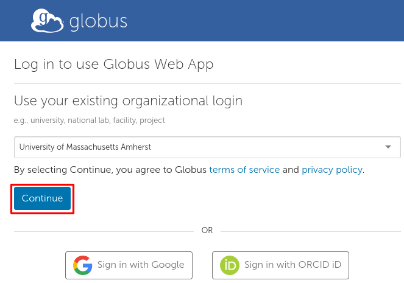
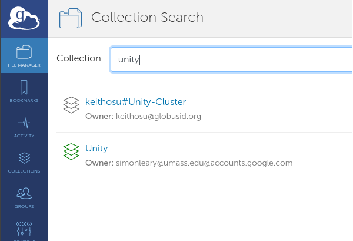

## Globus ##
Globus Connect allows for transfers between Globus collections.

This can be useful, for example, when migrating from one HPC cluster to another.

[How can I transfer files to and from my local machine with Globus?](https://docs.globus.org/faq/transfer-sharing/#how_can_i_transfer_files_to_and_from_my_laptop_or_desktop)

### Using Globus Connect in your browser ###

**Know which two Globus collections you want to transfer between.**

One is presumably Unity. The other could be your local machine if you install Globus Connect Personal. (see above)

**Go to [app.globus.org](https://app.globus.org)**

**If prompted, select your university and login with their identity provider.**

**Go to the File Manager and select a collection.**

Either collection involved in your transfer will do. At the time of this writing, there is more than one collection named Unity.
The following string can be pasted into the search box to select our Globus endpoint:
`acda5457-9c06-4564-8375-260ba428f22a`

Once a collection is selected, there should be two mirrored panels. If not, **select the split panel layout in the top right:**

**Select the other collection involved in your transfer.** This will take you back to the collection search page.

Of the two split panels, each has a Collection, a **Path**, a number of **selected** files, and a **Start** button to copy the selected files to the other side. Below is one panel:

**Configure your transfer and press 'Start'.**
