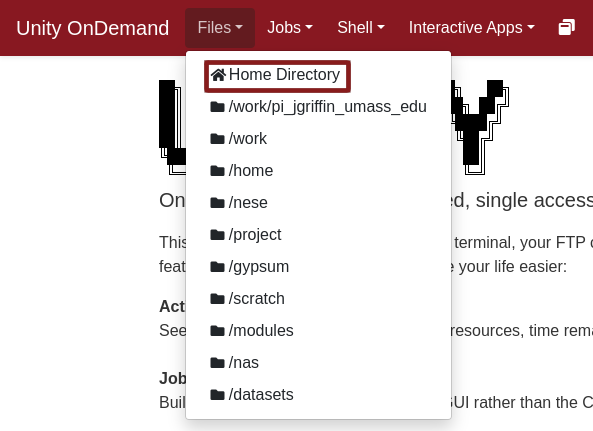
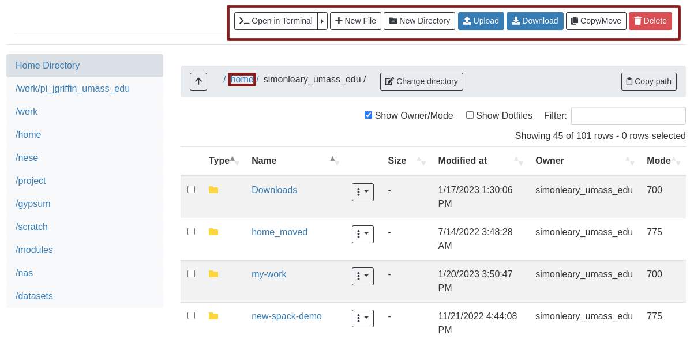

[Unity OnDemand](http://ood.unity.rc.umass.edu) is the easiest way to work with the Unity filesystem.

Unity OnDemand uses your organization's identity provider to give access to Unity. This means that you no longer need to install SSH/FileZilla, configure SSH, setup public and private keys, **all you need to do is login with your browser like any other site.**

### You can ...
* navigate the filesystem
* copy, move, create, and delete files and directories
* upload and download files from/to your local machine
* edit text files
* view images
* open a given directory in an interactive session on a compute node

### Opening the File Explorer

Login to [Unity OnDemand](http://ood.unity.rc.umass.edu) with your organization's identity provider, and click `Files > Home Directory`.

It should change your tab to look like this:

### Navigating
Click on directories to open them. You can click on different parts of your current working directory to go back. For example, with `/home/simonleary_umass_edu` as my current working directory, I can go back to `/home` by clicking on it:

### Other functions
You can edit a text file by clicking on it. You can view an image by clicking on it. You can open your current working directory in an interactive session with the `Open in Terminal` button. Most of the functions listed above are buttons to be pressed at the top of the file explorer. These should be mostly self explanatory.

#