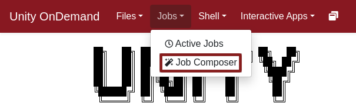
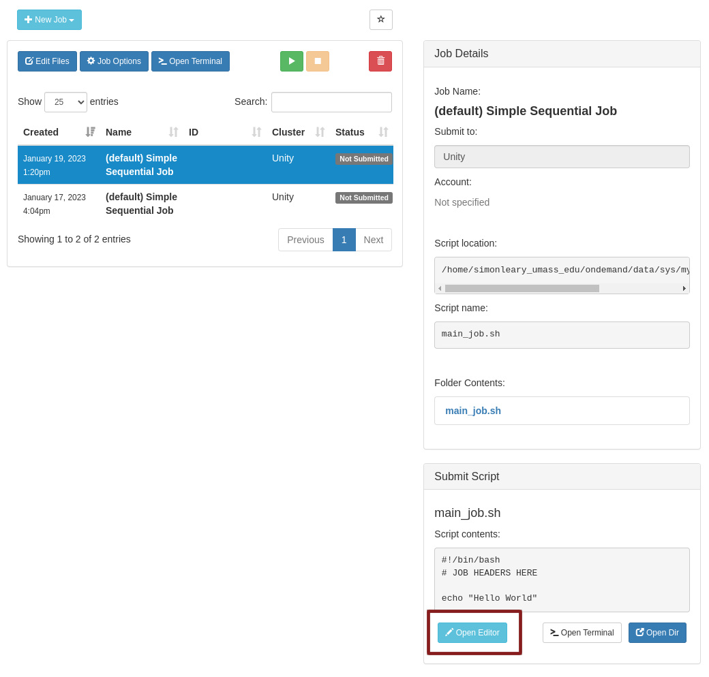
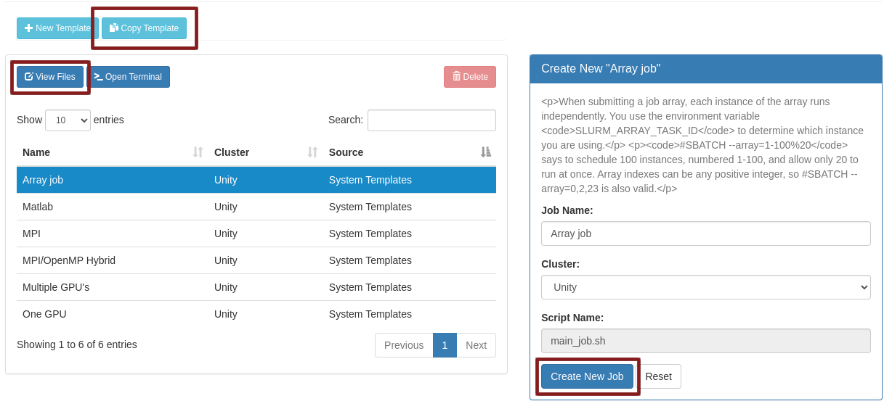
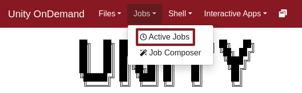
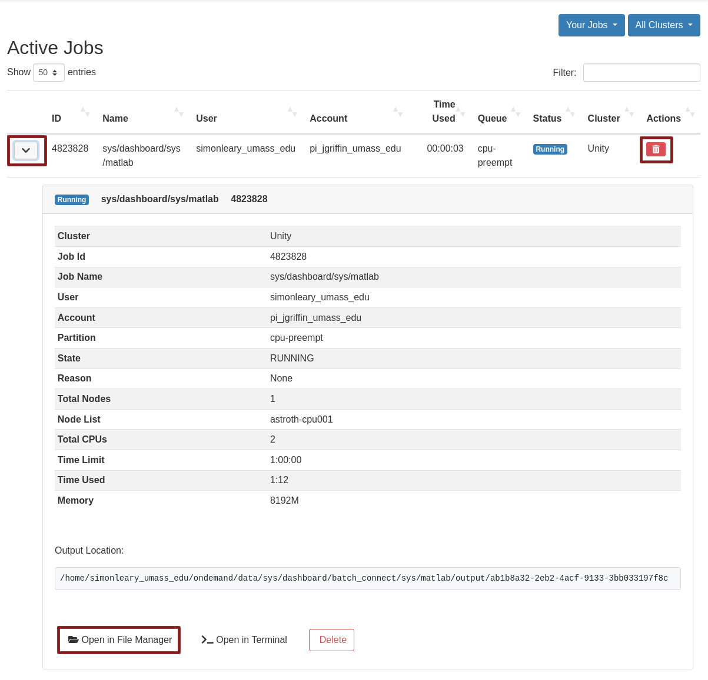

[Unity OnDemand](https://ood.unity.rc.umass.edu) gives you access to much of Slurm's functionality without any use of the command line.

There are three main features of Unity OnDemand job management:

* **Job Composer**: Customize and schedule batch jobs
* **Job Templater**: Make templates from jobs and jobs from templates
* **Active Job Viewer**: List jobs, kill jobs, read output files

!!!note
    One thing that OpenOnDemand lacks is a view of previously submitted jobs. The Active Job Viewer is based off of `squeue`, and a job only stays behind in `squeue` for 5 minutes after it is completed. (as of Jan. 2023)

### Job Composer
You can open the job composer by clicking on `Jobs > Job Composer` or by following [this link](https://ood.unity.rc.umass.edu/pun/sys/dashboard/apps/show/myjobs).

It should open a new tab that looks like this:

### Job Templates
You can open the job templates by clicking on `Job Composer > Templates` or by following [this link](https://ood.unity.rc.umass.edu/pun/sys/myjobs/workflows/new).

It should change your tab to look like this:

!!!note
    You might notice that the job template descriptions are displayed "literally", with unwanted `
` and `<code>` tags. This is a bug in OpenOnDemand and should be patched soon.

We have a number of job templates at your disposal. You can select a template and copy it to your home directory with the `Copy Template` button. Then a copy of that template should appear in the list with a source of `My Templates` rather than `System Templates`. You can select your copy, `View Files`, and edit the job. When you're satisfied, select `Create New Job`.

### Active Jobs
You can view information on your jobs, view the output files from your jobs, and kill your jobs from the Active Jobs page. Open it by clicking `Jobs > Active Jobs` or by following [this link](https://ood.unity.rc.umass.edu/pun/sys/dashboard/activejobs)

It should change your tab to look like this:

#
#
