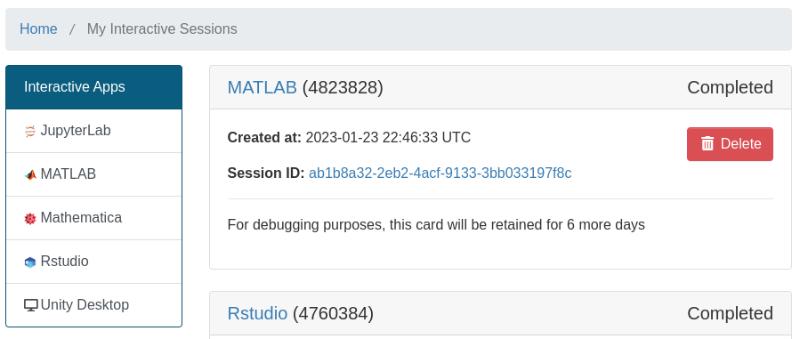
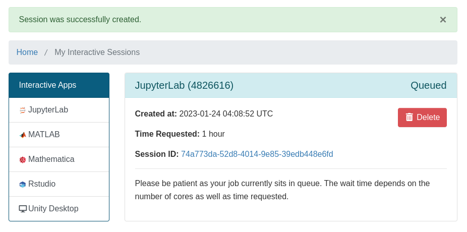
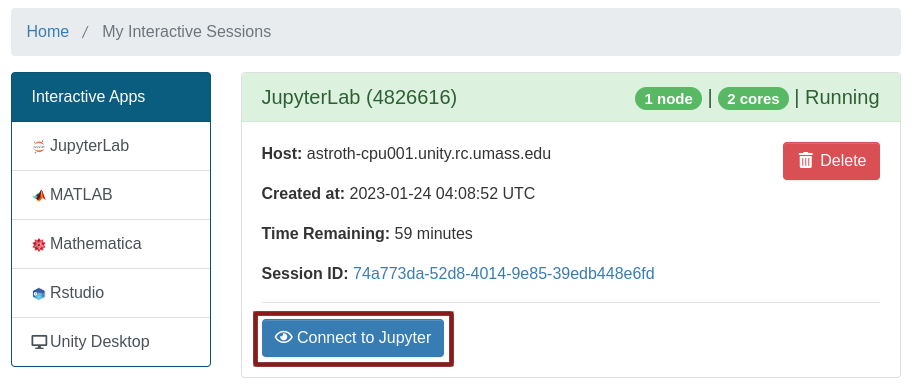

Unity OnDemand provides "Batch Connect", which starts your software as a batch job, then connects you to your software via a VNC server. Anything that you could have run via X11 forwarding can now be run much faster and more easily through Batch Connect.

As of Jan. 2023, we provide JupyterLab, Matlab, Rstudio, Mathematica, and a XFCE, a general-purpose interactive desktop environment.

You can begin by clicking on `Interactive Sessions` or by following [this link](https://ood.unity.rc.umass.edu/pun/sys/dashboard/batch_connect/sessions).

It should change your tab to look like this:

You can select an app from the list on the left. This should open a form. Select the resources you would like to schedule (CPU threads, time, GPU's) and leave any fields blank that you don't understand or don't care about. Then click `Launch`.

This should return you to `My Interactive Sessions`. Here, you will see your job waiting in the queue.

When it has left the queue, it will turn from `Queued` to `Starting` to `Running`, and a blue button should appear at the bottom of the job card. Click it to connect to your job.

