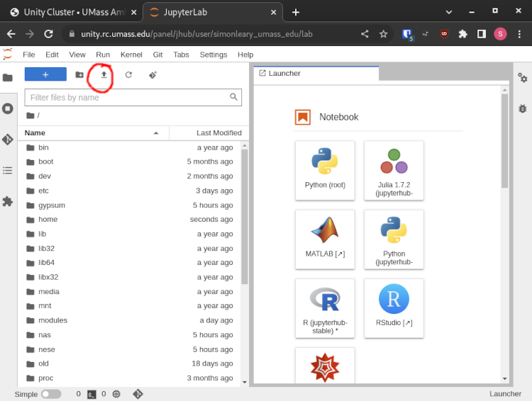

# Uploading Files to the Unity Filesystem
The only way to add files to the Unity filesystem is through an SSL encrypted connection. It can be done with FileZilla (recommended), in JupyterLab, or in the command line.

!!! note
    Uploading files using American residential internet is typically painfully slow.
    UMass Amherst has a fibre line going directly to MGHPCC to improve speeds.

## Your Key File ##
When you set up your Unity account, you chose between PuTTY (`.ppk`) and OpenSSH. (`.rsa`)

`scp` and `rsync` use OpenSSH, and FileZilla prefers `.ppk` but can work with `.rsa`.

Depending on which software you use, you can generate one of each.

[Account Settings](https://unity.rc.umass.edu/panel/account.php)

!!! note
    It's recommended that you place this downloaded private key in your home directory's `.ssh` folder.
    This is `C://Users/YOUR_NAME/.ssh` in Windows, `/home/YOUR_NAME/.ssh` in Linux, and `/Users/YOUR_NAME` in Mac.

## FileZilla ##
FileZilla can use either an `.rsa` or a `.ppk` private key, but the 'Browse' button will show only `.ppk` files. To use an `.rsa` key, type in the path to the keyfile by hand.

This guide assumes that your key lives at `~/.ssh/KEYFILE`, but you can substitute this path.

You can install FileZilla [here](https://filezilla-project.org/download.php?type=client)

* FileZilla may ask you if you want to install McAfee, you probably don't. If you don't have antivirus already, you probably should.
* The FileZilla installer executable can be sometimes marked as a virus, it isn't.

Select the Site Manager in FileZilla:


Create a New Site:


Fill in the Fields:

* Type a name for the site under My Sites on the left
* Protocol: SFTP
* Host: unity.rc.umass.edu
* User: your email but replace the `.` and `@` with `_`
* Key File: /path/to/your/keyfile


This configuration is saved automatically.
You can use the 'Connect' button in the bottom right to open an explorer on the Unity Filesystem,and you can drag and drop your files across the two panels.

Properly connected, FileZilla should look like this:


## JupyterLab ##
Start a session in JupyterLab. Navigate to your home directory, and click the upload button.


## CLI ##
It's best to try this after you have already successfully connected to Unity with OpenSSH.

As these are CLI procedures, the first thing you need to do is open your terminal and navigate to the directory (folder) where the files you want to upload are located. Alternatively you can use [absolute paths](https://networkencyclopedia.com/absolute-path/) in your command and skip this step.
```
# Windows
cd C://Users/YOUR_NAME/Desktop
# Linux
cd /home/$USER/Desktop
# Mac
cd /Users/YOUR_NAME/Desktop
```
Assuming, of course, that the files you want to upload are located in your desktop directory.
And in the Windows case, assuming that the drive you want to copy from is the C drive.

!!! note
    If your file name contains spaces, you will have to put it in quotes.

### SCP ###
OpenSSH comes with the `scp` command, which uses the same argument structure as `cp` (copy) but with the added benefit of referencing the OpenSSH config file (`~/.ssh/config`). This is how I can use `unity` as part of a command, because the OpenSSH config file contains the connection information for host `unity`.
```
# single file
scp FILE_NAME unity:~

# entire directory
scp -r DIRECTORY_NAME unity:~
```
!!! note
    `-r` in many commands is short for 'recursive'.
    It tells the `scp` command to recursively open DIRECTORY_NAME
    and any other directories contained within to ensure that all files are copied.

!!! note
    `~` in the terminal represents your home directory.

This will copy the files in question to your Unity home directory.
You could also upload to elsewhere on the Unity filesystem, wherever you have permissions.

### RSYNC ###
`rsync` can be installed on Linux and Mac. The syntax is the same as `scp`.
```
# single file
rsync FILE_NAME unity:~

# entire directory
rsync -r DIRECTORY_NAME unity:~
```


## Globus ##
Coming soon!